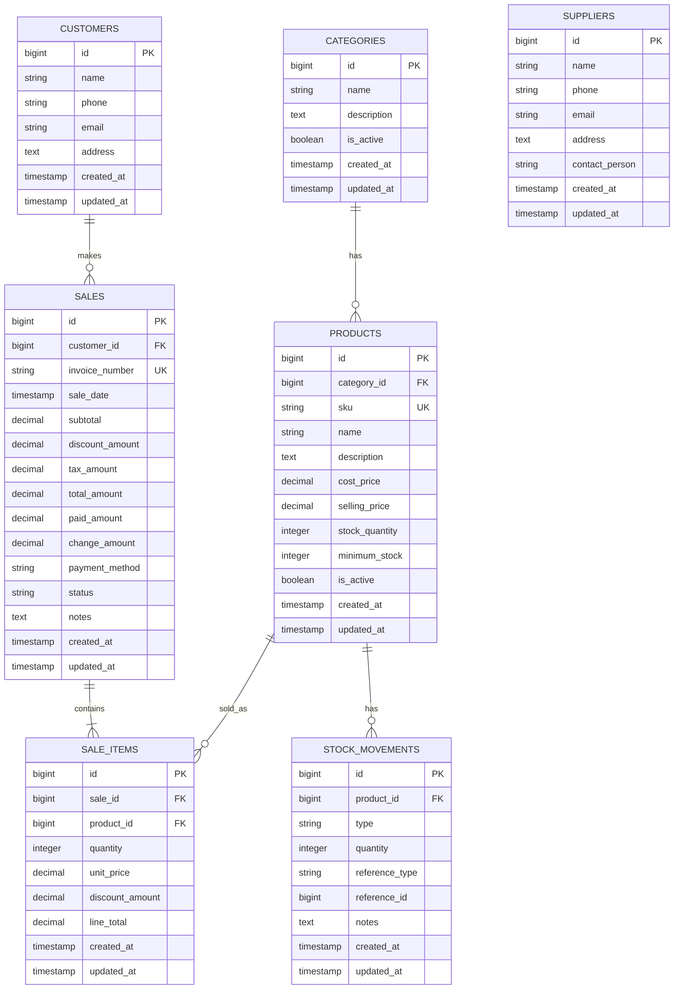

# Entity Relationship Diagram

## 1. Ringkasan

ERD ini menggambarkan struktur data POS Application berdasarkan migration database MVP.

## 2. Mermaid ERD

## 3. Entity Description

| Entity | Fungsi |
| --- | --- |
| categories | Mengelompokkan produk |
| products | Menyimpan master produk, harga, stok, dan status aktif |
| customers | Menyimpan pelanggan yang dapat dikaitkan ke transaksi |
| suppliers | Menyimpan supplier, belum terhubung ke purchase order pada MVP |
| sales | Header transaksi penjualan |
| sale_items | Detail item pada transaksi penjualan |
| stock_movements | Riwayat perubahan stok manual atau otomatis dari penjualan |

## 4. Relationship Detail

| Relasi | Cardinality | Constraint |
| --- | --- | --- |
| categories to products | 1 to many | products.category_id nullable, null on delete |
| customers to sales | 1 to many | sales.customer_id nullable, null on delete |
| sales to sale_items | 1 to many | sale_items.sale_id cascade on delete |
| products to sale_items | 1 to many | sale_items.product_id restrict on delete |
| products to stock_movements | 1 to many | stock_movements.product_id cascade on delete |

## 5. Index and Key Notes

| Table | Key / Constraint |
| --- | --- |
| products | sku unique |
| sales | invoice_number unique |
| sale_items | sale_id FK, product_id FK |
| stock_movements | product_id FK, reference_type/reference_id polymorphic reference |

## 6. Data Design Notes

- `stock_quantity` disimpan di products untuk akses cepat.
- `stock_movements` menjadi history perubahan stok.
- Penjualan otomatis membuat stock movement dengan `reference_type = sale`.
- Supplier belum memiliki relasi ke produk atau pembelian pada MVP.
- Belum ada table users, roles, audit_logs, shifts, payments detail, returns, dan refunds.
- Static password gate, pilihan bahasa, dan session akses disimpan di browser storage sehingga tidak menambah table database.
- Cetak struk thermal Bluetooth memakai data `sales`, `sale_items`, `customers`, dan `products` yang sudah tersedia; tidak ada table khusus printer atau receipt pada MVP.
