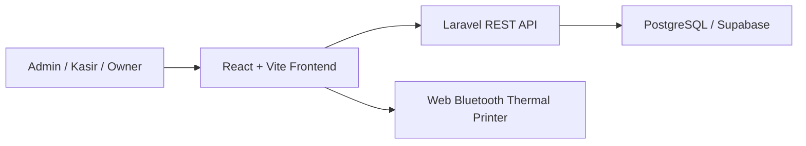

# Software Requirement Specification

## 1. Ringkasan Sistem

POS Application adalah aplikasi web dengan frontend React dan backend Laravel API. Sistem menyimpan data pada PostgreSQL/Supabase dan menyediakan endpoint REST untuk dashboard, master data, stock movement, dan transaksi penjualan.

## 2. Architecture Overview

## 3. Technology Stack

| Layer | Teknologi |
| --- | --- |
| Frontend | React, Vite |
| Backend | Laravel API |
| Database | PostgreSQL melalui Supabase |
| API Style | REST JSON |
| Deployment target | Web app, local/server hosted, Vercel frontend |
| Browser Hardware API | Web Bluetooth untuk printer thermal BLE ESC/POS |

## 4. System Modules

| Modul | Komponen Teknis |
| --- | --- |
| Dashboard | DashboardController |
| Kategori | CategoryController, Category model |
| Produk | ProductController, Product model |
| Pelanggan | CustomerController, Customer model |
| Supplier | SupplierController, Supplier model |
| Stock movement | StockMovementController, StockMovement model |
| Penjualan | SaleController, SaleService, Sale, SaleItem, StockMovement |
| Akses frontend | Static password gate, sessionStorage |
| Bahasa | Frontend dictionary Indonesia/English, localStorage preference |
| Cetak struk | Frontend receipt formatter, Web Bluetooth writer, ESC/POS payload |
| Loading overlay | Frontend busy state untuk mencegah double click pada aksi async |

## 5. API Specification

### 5.1 Health and Dashboard

| Method | Endpoint | Fungsi |
| --- | --- | --- |
| GET | /api/health | Mengecek status API |
| GET | /api/dashboard | Mengambil ringkasan dashboard |

### 5.2 Master Data

| Method | Endpoint | Fungsi |
| --- | --- | --- |
| GET | /api/categories | List kategori |
| POST | /api/categories | Create kategori |
| GET | /api/categories/{id} | Detail kategori |
| PUT/PATCH | /api/categories/{id} | Update kategori |
| DELETE | /api/categories/{id} | Delete kategori |
| GET | /api/products | List produk |
| POST | /api/products | Create produk |
| GET | /api/products/{id} | Detail produk |
| PUT/PATCH | /api/products/{id} | Update produk |
| DELETE | /api/products/{id} | Delete produk |
| GET | /api/customers | List pelanggan |
| POST | /api/customers | Create pelanggan |
| GET | /api/suppliers | List supplier |
| POST | /api/suppliers | Create supplier |

### 5.3 Stock and Sales

| Method | Endpoint | Fungsi |
| --- | --- | --- |
| GET | /api/stock-movements | List stock movement |
| POST | /api/stock-movements | Create stock movement manual |
| GET | /api/stock-movements/{id} | Detail stock movement |
| GET | /api/sales | List transaksi |
| POST | /api/sales | Create transaksi |
| GET | /api/sales/{id} | Detail transaksi |

Catatan query `GET /api/sales`:

- `search`: mencari invoice, nama pelanggan, nama produk, SKU, metode bayar, atau status.
- `page`: nomor halaman pagination.
- `per_page`: jumlah data per halaman, dibatasi maksimal 100.

## 6. Core Logic

### 6.1 Sale Transaction Logic

1. Sistem menerima payload transaksi.
2. Sistem mengunci produk terkait menggunakan database transaction dan row lock.
3. Sistem memvalidasi produk aktif dan stok cukup.
4. Sistem menghitung line total dari harga jual, quantity, dan diskon item.
5. Frontend menerima diskon item, diskon transaksi, dan pajak sebagai persen lalu mengonversinya menjadi nominal payload API.
6. Sistem menghitung subtotal, diskon transaksi, pajak, total, pembayaran, dan kembalian.
7. Sistem menolak transaksi jika total negatif atau pembayaran kurang.
8. Sistem membuat record sale.
9. Sistem membuat record sale_items.
10. Sistem mengurangi stock_quantity produk.
11. Sistem membuat stock_movements dengan type `out` dan reference_type `sale`.
12. Frontend menerima response transaksi lengkap dengan customer dan item.
13. Frontend menampilkan popup cetak struk atau tutup.

### 6.2 Receipt Printing Logic

1. User menekan tombol `Cetak Struk` dari popup transaksi atau riwayat transaksi.
2. Frontend memvalidasi dukungan `navigator.bluetooth`.
3. Browser menampilkan dialog pemilihan printer Bluetooth.
4. Frontend mencari service dan characteristic printer yang umum dipakai thermal printer BLE.
5. Frontend menyusun struk 32 kolom dalam format ESC/POS.
6. Frontend mengirim payload ke printer dalam chunk kecil.
7. Sistem menampilkan pesan berhasil atau error kompatibilitas.

### 6.3 Stock Movement Logic

| Type | Perhitungan |
| --- | --- |
| in | stock_quantity + quantity |
| out | stock_quantity - quantity |
| adjustment | stock_quantity menjadi quantity yang diinput |

Sistem menolak hasil movement jika stok menjadi negatif.

## 7. Data Requirements

Entity utama:

- categories
- products
- customers
- suppliers
- sales
- sale_items
- stock_movements

Detail relasi tersedia di [ERD.md](ERD.md).

## 8. Non-Functional Requirements

| Kode | Requirement | Target |
| --- | --- | --- |
| NFR-01 | Availability | Sistem dapat diakses selama jam operasional |
| NFR-02 | Performance | Endpoint list dan transaksi sederhana merespons dalam waktu wajar untuk data MVP |
| NFR-03 | Scalability | Struktur API dan database dapat dikembangkan ke multi-user dan reporting |
| NFR-04 | Maintainability | Modul backend dipisah per domain controller/model/service |
| NFR-05 | Security | API production harus dilindungi autentikasi dan authorization |
| NFR-06 | Data Integrity | Transaksi penjualan dan pengurangan stok harus atomic |
| NFR-07 | Auditability | Minimal stock movement dan sale item tercatat; audit user masih future scope |
| NFR-08 | Compatibility | Cetak Bluetooth membutuhkan Chrome/Edge, HTTPS atau localhost, dan printer BLE ESC/POS |
| NFR-09 | Usability | UI mendukung bahasa Indonesia dan English untuk label utama, tombol, dan pesan feedback |
| NFR-10 | Interaction Safety | Aksi async harus menampilkan loading overlay dan memblokir klik tambahan sampai proses selesai |
| NFR-11 | Input Clarity | Field input harus memakai placeholder, separator angka, dan suffix persen jika relevan |

## 9. Error Handling

| Kondisi | Response yang Diharapkan |
| --- | --- |
| Data tidak valid | HTTP 422 dengan pesan validasi |
| Record tidak ditemukan | HTTP 404 |
| Stok tidak cukup | HTTP 422 |
| Pembayaran kurang | HTTP 422 |
| Produk tidak aktif | HTTP 422 |
| Browser tidak mendukung Web Bluetooth | Pesan error frontend |
| Printer Bluetooth tidak kompatibel | Pesan error frontend |

## 10. Security Notes

Saat ini frontend memiliki static password gate untuk membatasi akses ringan pada deployment dev/internal. Ini bukan pengganti autentikasi backend karena password berada di bundle frontend dan API belum memiliki authorization.

Untuk production, sistem harus menambahkan:

- Login user.
- Role admin, kasir, owner.
- Authorization per endpoint.
- Password hashing.
- Session atau token security.
- Audit log untuk create/update/delete dan transaksi penting.

## 11. Deployment Requirements

| Area | Requirement |
| --- | --- |
| Backend | PHP 8.3+, Composer, Laravel runtime |
| Frontend | Node.js 20+, Vite build |
| Database | PostgreSQL/Supabase connection string |
| Environment | `.env` backend dan frontend harus dikonfigurasi |
| Printer | Chrome/Edge, HTTPS atau localhost, printer thermal Bluetooth BLE ESC/POS |

## 12. Known Limitations

- Dependency backend belum diverifikasi di environment saat project dibuat karena PHP dan Composer belum tersedia di PATH.
- Belum ada automated test.
- Static password gate sudah tersedia di frontend, tetapi belum ada auth backend, role, audit trail, dan logging operasional detail.
- Cetak struk Bluetooth bergantung pada kompatibilitas browser dan printer BLE ESC/POS; printer Bluetooth Classic/SPP belum tentu didukung browser.
